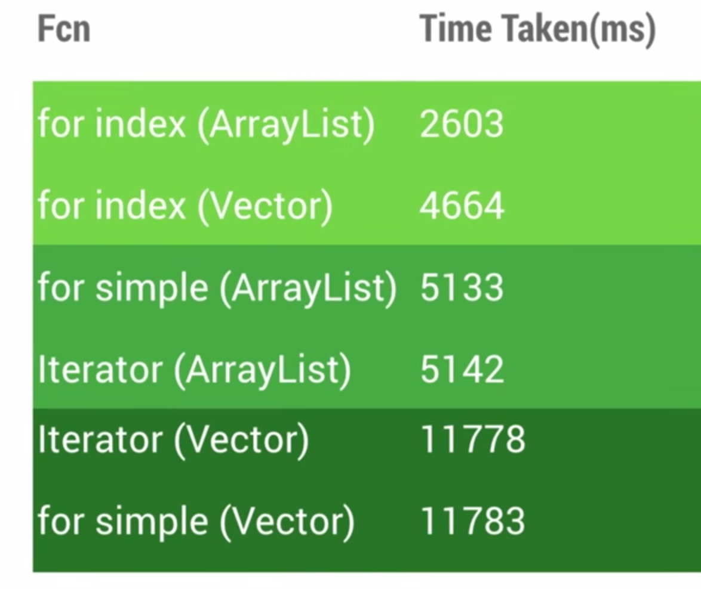

#安卓性能优化

##内存泄漏
+  Java的非静态内部类、匿名类，会持有外部类的强引用，静态的不会持有；对于Activity/Fragment内定义的Handler/Runnable，是最容易因此导致内存泄漏的，因为它们可能会postDelayed，从而导致Activity/Fragment及其内部的资源无法GC；推荐做法是定义静态内部类/静态匿名成员，访问外部类的成员和方法通过WeakRefrence实现；
+  WeakRefrence需要在内部类内创建才符合其语义？

##谷歌安卓团队对于性能优化的建议

+  [对数据集合的遍历，性能对比](https://youtu.be/R5ON3iwx78M?list=PLWz5rJ2EKKc9CBxr3BVjPTPoDPLdPIFCE)：使用iterator，简化版语法，用索引遍历；

##性能优化的几大考虑
+  Mobile Context
  +  资源受限
    +  内存，普遍较小，512MB很常见，开发者的机器一般比用户的机器高端
    +  CPU，核心少，运算能力没有全开
    +  GPU，上传大的纹理（texture），overdraw
  +  内存开销大，会导致系统换入换出更频繁，GC更频繁，APP被kill、被重启更频繁，不仅会消耗更多电量，而且GC会消耗大量时间，使得应用程序渲染速度低于60fps（GC耗时dalvik 10-20ms，ART 2-3ms）
  +  外部存储与网络，也是受限的，需要考虑资源的使用、网络请求的优化
+  The Rules: Memory
  +  Avoid Allocations in Inner Loops
  +  Avoid Allocations When Possible
    +  Cached objects
  	+  Object pools：注意线程安全问题
  	+  ArrayList v.s. 数组
  	+  Android collections classes：HashMap v.s. ArrayMap/SimpleArrayMap
  	+  Methods with mutated objects
  	+  Avoid object types when primitive types will do：SparseIntArray，SparseLongArray
  	+  Avoid arrays of objects
  +  Avoid Iterators：显式与隐式（foreach语句），会导致一个Iterator的分配，即便是空集合。
  +  Avoid Enums
  +  Avoid Frameworks and Libraries Not Written for Mobile Applications
  +  Avoid Static Leaks
  +  Avoid Finalizers
  +  Avoid Excess Static Initialization
  +  Trim caches on demand
  +  Use isLowRamDevice：ActivityManager.isLowRamDevice()
  +  Avoid Requesting a Large Heap
  +  Avoid Running Services Longer than Necessary：BroadcastReceiver，IntentService
  +  Optimize for Code Size
    +  Use Proguard to strip out unused code
    +  Carefully consider your library dependencies
    +  Make sure to understand the cost of any code which is automatically generated
    +  Prefer simple, direct solutions to problems rather than creating a lot of infrastructure and abstractions to solve those problems
