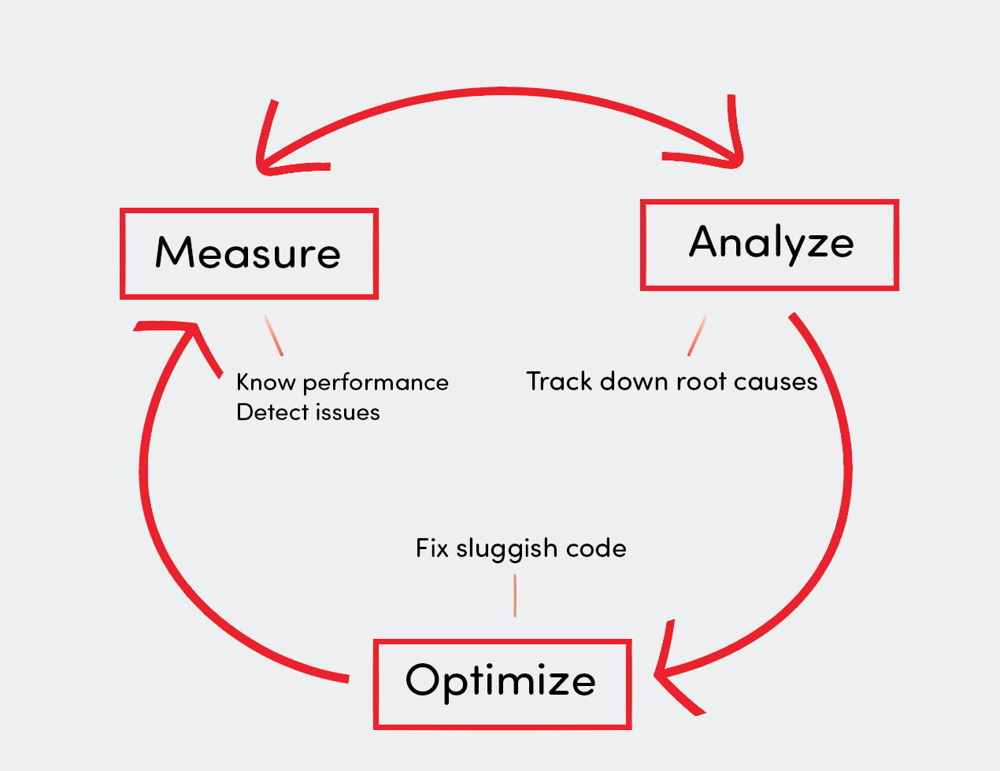

#安卓性能优化

##性能优化的几大考虑
+  Mobile Context
  +  资源受限
    +  内存，普遍较小，512MB很常见，开发者的机器一般比用户的机器高端
    +  CPU，核心少，运算能力没有全开
    +  GPU，上传大的纹理（texture），overdraw
  +  内存开销大，会导致系统换入换出更频繁，GC更频繁，APP被kill、被重启更频繁，不仅会消耗更多电量，而且GC会消耗大量时间，使得应用程序渲染速度低于60fps（GC耗时dalvik 10-20ms，ART 2-3ms）
  +  外部存储与网络，也是受限的，需要考虑资源的使用、网络请求的优化
+  The Rules: Memory
  +  Avoid Allocations in Inner Loops
  +  Avoid Allocations When Possible
    +  Cached objects
  	+  Object pools：注意线程安全问题
  	+  ArrayList v.s. 数组
  	+  Android collections classes：HashMap v.s. ArrayMap/SimpleArrayMap
  	+  Methods with mutated objects
  	+  Avoid object types when primitive types will do：SparseIntArray，SparseLongArray
  	+  Avoid arrays of objects
  +  Avoid Iterators：显式与隐式（foreach语句），会导致一个Iterator的分配，即便是空集合。
  +  Avoid Enums
  +  Avoid Frameworks and Libraries Not Written for Mobile Applications
  +  Avoid Static Leaks
  +  Avoid Finalizers
  +  Avoid Excess Static Initialization
  +  Trim caches on demand
  +  Use isLowRamDevice：ActivityManager.isLowRamDevice()
  +  Avoid Requesting a Large Heap
  +  Avoid Running Services Longer than Necessary：BroadcastReceiver，IntentService
  +  Optimize for Code Size
    +  Use Proguard to strip out unused code
    +  Carefully consider your library dependencies
    +  Make sure to understand the cost of any code which is automatically generated
    +  Prefer simple, direct solutions to problems rather than creating a lot of infrastructure and abstractions to solve those problems
+  The Rules: Performance
  +  Avoid Expensive Operations During Animations and User Interaction  
  动画的每一帧渲染都是在UI线程的，如果有动画的时候进行耗时操作，很可能导致动画不流畅，耗时操作包括：
    +  Layout：当动画正在播放的时候，要避免改变View（延迟改变）；同时选择动画也需要避免会触发layout的动画，例如translationX，translationY只会导致延迟的layout操作，而LayoutParams属性，则会导致即时的layout。
    +  Inflation：动画过程中避免inflate新的view，比如启动新的activity，或者ListView滑动到不同type的区域。
  +  Launch Fast
    +  Avoid this problem by launching as fast as possible
    +  Also, avoid initialization code in your Application object
  +  Avoid Complex View Hierarchies
    +  One approach to avoiding complex nested hierarchies is to use custom views or custom layouts in some situations; it may be cheaper for a single view to draw several pieces of text and icons rather than have a series of nested ViewGroups to accomplish this.
    +  结合的准则就是根据他们是否需要单独和用户完成交互（响应点击事件等）
  +  Avoid RelativeLayout Near the Top of the View Hierarchy  
  RelativeLayout需要两次measurement passes才能确定布局正确，嵌套RelativeLayout，是幂乘关系
  +  Avoid Expensive Operations on the UI Thread
  +  Minimize Wakeups
  +  Develop for the Low End
  +  Measure Performance
+  The Rules: Networking
  +  Don’t Over-Sync：batch it up with other system requests with JobScheduler or GCM Network Manager.
  +  Avoid Overloading the Server
  +  Don’t Make Assumptions about the Network
  +  Develop for Low End Networks
  +  Design Back-End APIs to Suit Client Usage Patterns：相关数据一个请求分发完毕；不相关的数据分接口分发；客户端应对获取的数据具备足够的信息；
+  The Rules: Language and Libraries
  +  Use Android-Appropriate Data Structures: ArrayMap, SparseArray
  +  Serialization
    +  Parcelable：安卓系统IPC格式；把Parcel写到磁盘是不安全的；解包方必须能访问Parcel的类，否则将失败；特定的类（Bitmap，CursorWindow）将被写到SharedPreference中，而通过Parcel传递的只是文件的fd，存在性能优化的空间，但是也节约了内存；
    +  Persistable Bundles：API 21引入，序列化为XML，支持的类型比Parcel少，但是为Bundle子类，某些场景方便处理；
    +  Avoid Java Serialization：额外开销更大，性能更差
    +  XML and JSON：效率更低，复杂数据应考虑前述选项
  +  Avoid JNI
    +  需要考虑多种处理器架构，指针用long保存
    +  java->jni, jni->java调用开销都很大，一次JNI调用做尽可能多的工作
    +  内存管理，java对象管理jni对应对象的生命周期
    +  错误处理，在调用JNI之前检查参数
    +  参数对象尽量“传值”调用，即：展开后传递，不要在JNI里面使用指针访问成员，避免JNI过程中对象被回收
  +  Prefer Primitive Types：内存、性能
+  The Rules: Storage
  +  Avoid Hard-coded File Paths
  +  Persist Relative Paths Only
  +  Use Storage Cache for Temporary Files
  +  Avoid SQLite for Simple Requirements
  +  Avoid Using Too Many Databases
  +  Let User Choose Content Storage Location
+  The Rules: Framework
  +  Avoid Architecting Around Application Components
  +  Services Should Be Bound or Started, Not Both
  +  Prefer Broadcast over Service for Independent Events：Use broadcasts for delivering independent events; use services for processes with state and on-going lifecycle.
  +  Avoid Passing Large Objects Through Binder
  +  Isolate UI processes from Background Services
+  The Rules: User Interface
  +  Avoid Overdraw
  +  Avoid Null Window Backgrounds  
  put the background drawable you want on the window itself with the windowBackground theme attribute and let those intervening containers keep their default transparent backgrounds.
  +  Avoid Disabling the Starting Window（windowDisablePreview/windowBackground）
  +  Allow Easy Exit from Immersive Mode
  +  Set Correct Status/Navigation Bar Colors in Starting Window
  +  Use the Appropriate Context
  +  Avoid View-Related References in Asynchronous Callbacks
  +  Design for RTL
  +  Cache Data Locally
  +  Cache User Input Locally
  +  Separate Network and Disk Background Operations
+  Tools
  +  Host Tools
    +  Systrace
    +  AllocationTracker
    +  Traceview
    +  Hierarchyviewer
    +  MAT (Memory Analysis Tool)
    +  Memory Monitor
    +  meminfo
  +  On-device tools
    +  StrictMode
    +  Profile GPU rendering
    +  Debug GPU overdraw
    +  Animator duration scale
    +  Screenrecord
    +  Show hardware layer updates

##谷歌安卓团队对于性能优化的建议
+  [Profile GPU rendering]
  +  两个区域（虚拟键盘设备会有三个区域），从上到下分别表示：状态栏绘制、主窗口绘制、虚拟键盘区域绘制
  +  三种颜色
    +  蓝色：draw time，Java代码创建、更新display list所消耗的时间；onDraw函数中使用Canvas调用的draw*函数的执行时间；convert to GPU description, cache as display list；
      +  蓝色过高，可能因为大量view被invalidate，需要重绘，或者是onDraw方法的逻辑过于复杂，执行时间长
    +  红色：execute time，Android 2D renderer执行display list所消耗的时间（通过Open GL接口，使用GPU绘制）；自定义View越复杂，GPU渲染所需时间越长；
      +  红色过高，原因很可能就是View的构成太复杂；极高的峰值，可能是因为重新提交了视图绘制造成的，并非view被invalidate，而是类似于View旋转这样的变化，需要先清空原有区域，再重新绘制；
    +  橙色：process time，CPU通知GPU渲染结束消耗的时间，同步调用
      +  橙色过高，可能是View太复杂，渲染需要太多时间

+  [对数据集合的遍历，性能对比](https://youtu.be/R5ON3iwx78M?list=PLWz5rJ2EKKc9CBxr3BVjPTPoDPLdPIFCE)：使用iterator，简化版语法，用索引遍历；


##Square团队的建议
+  [Eliminating Code Overhead by Jake Wharton](https://www.youtube.com/watch?v=b6zKBZcg5fk&feature=youtu.be)
  +  CPU
    +  Do not nest multi-pass layouts: RelativeLayout, LinearLayout with layout_weight...
    +  Lazily compute complex data when needed
    +  Cache heavy computational results for re-use
    +  Consider RenderScript for performance
    +  Keep work off main thread
  +  Memory
    +  Use object pools and caches to reduce churn (judiciously)
    +  Be mindful of the overhead of enums
    +  Do not allocate inside the draw path
    +  Use specialized collections instead of JDK collections when appropriate (SparceArray...)
  +  I/O
    +  Batch operations with reasonable back-off policies
    +  Use gzip or binary serialization format
    +  Cache data offline with TTLs for reloading
    +  Use JobScheduler API to batch across OS
  +  Spectrum of optimizations, not binary
  +  Do not blindly apply to everything, only appropriate
  +  Multiple micro-optimizations can improve like macro
  +  ArrayList分配：会有一个默认初始值，以后空间不够时按倍增策略进行扩展
    +  如果创建时就知道其大小，则可以new一个已知容量的ArrayList，避免后面扩容、数据复制的成本
    +  
  +  StringBuilder：同样的，也可以先给一个预估的大小，然后直接初始化该大小的StringBuilder；安卓开发build时会自动把String的拼接操作转化为StringBuilder实现，然而这种自动的转换未必高效；
    +  例子
    ```java
      for (int x = 0; x < valueCount; x++) {
          cleanFiles[x] = new File(directory, key + "." + x);
          dirtyFiles[x] = new File(directory, key + "." + x + ".tmp");
      }
    ```
    ===>>>
    ```java
      StringBuilder b = new StringBuilder(key).append(".");
      int truncateTo = b.length();
      for (int x = 0; x < valueCount; x++) {
          b.append(x);
          cleanFiles[x] = new File(directory, b.toString());
          b.append(".tmp");
          dirtyFiles[x] = new File(directory, b.toString());
          b.setLength(truncateTo);
      }
    ```
  +  其他
    +  对函数的调用（尤其是虚函数、接口函数）结果，如果同一个作用域中有多次调用，且结果确定不变，应该将他们转化为一次调用：`for (int i = 0, size = list.size(); i < size; i++)`
    +  对集合的遍历，不要使用语法糖，会有额外开销（Iterator创建、虚函数调用等）

##[NimbleDroid的建议](http://blog.nimbledroid.com/2015/09/17/how-to-make-your-application-fluid.html)
+  性能优化的流程  

+  Recommendation 1: limit app startup to 2 seconds
+  Recommendation 2: eliminate hung methods
+  Recommendation 3: measure as often as you can，怎么、什么粒度的profiling呢？
+  Recommendation 4: know a set of common issues
  +  ClassLoader.getResourceAsStream()
+  Recommendation 5: avoid surprises in 3rd-party SDKs