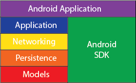

#安卓测试驱动开发/安卓测试验证
安卓测试主要包括两种：单元测试；集成测试；测试主要通过mock依赖，验证行为。单元测试框架、集成测试框架、Mock框架是TDD所需的主要工具。

##单元测试：[The Square Way](http://www.philosophicalhacker.com/2015/04/10/against-android-unit-tests/)
+  单元测试是方法级别的测试，需要测试的是一个类的公开接口/方法，测试其逻辑正确性，如果发现一个类的某个方法所使用的依赖难以mock，it's a smell，重构吧
+  基础理论部分
  +  The three steps of a unit test: arrange, act, and assert
  +  check the return value of the method    
  +  get a reference to some publicly accessible property of the object being tested
  +  check the state of the object’s injected dependencies
  +  所以编码时，应该尽量将代码逻辑的依赖通过注入的方式（或提供public setter，或将被测函数的依赖作为参数传入）提供，以便于测试
  +  post-act-state的验证要注意单元测试与集成测试的区别：单元测试只验证一个方法的逻辑正确性，不验证多个方法（模块）一起工作的逻辑正确性；
  +  static方法对测试非常不利，因为其对象依赖、方法依赖无法mock，而其post-act-state也通常无法assert，开发过程中应尽量避免
+  实践部分  
架构图  
  
Remove all business logic from app component classes (e.g., Activitys, Fragments, Services) and place that logic into “business objects”, POJO objects whose dependencies are injected, android-specific implementations of android-agnostic interfaces.  
Delegate all application specific behavior to POJO objects whose dependencies are Android-specific implementations of Android-agnostic interfaces.
+  Non-UI App Components  
把业务逻辑（比如根据数据类型执行不同操作、检查数据合法性等）从组件类中抽离出来，业务逻辑类对于组件类的依赖也不要直接使用使用，而是通过定义接口来实现耦合，这样就能使得业务逻辑类与SDK解耦。  
业务逻辑类的依赖通过依赖注入框架注入，便于测试时mock。  
而剩下的组件类工作简单，只负责转发业务逻辑类的功能请求，就没必要进行测试了。
+  UI App Component Classes  
通过MVP模式，将UI组件类和业务逻辑类解耦，同时移除对SDK组件类的依赖；  
pre-act-state，post-act-state，测试对象的依赖中，如果mock框架（如Mockito）可以mock，OK；如果不能mock（例如Activity，BroadcastReceiver），则可以通过定义接口的形式替换这些依赖，而接口的实现则是简单直接的转发，无需测试；pre-act-state便可以设置完毕，调用被测函数后，验证post-act-state即可。
+  Dependency Inject  
可以使用Constructor inject的类就不要使用Field inject。前者更利于单元测试。其实除了SDK组件类，其他的类基本上都可以使用Constructor inject。
+  无需依赖第三方框架（Robolectric，Dagger）
  
##Mock框架：[Mockito](http://mockito.org/)
+  stubbed的方法没有必要verify
+  当被测代码对返回值不关心时，不要stub
+  mock对象的方法默认将返回空值（null，空集合，默认基本类型值）
+  stub可以被重载，但当出现这种需求时，就说明stub已经太多了，需要改进设计
+  stub的顺序有影响，但不应依赖其顺序的影响
+  默认使用Java原生equals进行判断，也支持ArgumentMatcher，有内置，也支持自定义/Hamcrest，但最后者不建议使用（影响可读性）
+  一旦使用了ArgumentMatcher，则所有的参数都要使用ArgumentMatcher
+  `times(int)`，`never()`，`atLeastOnce()`，`atLeast(int)`，`atMost(int)`验证调用次数，verify默认的是`times(1)`，因此无需显式指定
+  验证无返回值函数抛出异常：`doThrow(new RuntimeException()).when(mockedList).clear();`
+  `InOrder`可以验证调用的顺序（不同语句），原则上只需要验证关键逻辑，没必要所有调用都需要验证、甚至其顺序
+  `only()`的语义：仅有该方法被调用，且仅被调用一次
+  `never()`的语义：该方法未被调用过
+  `verifyZeroInteractions(...)`的语义：mock对象没有任何方法调用
+  `verifyNoMoreInteractions(...)`：验证没有其他的调用（除了此前验证的方法）
+  对多次调用进行stub，最后一次将一直有效
+  doReturn()|doThrow()| doAnswer()|doNothing()|doCallRealMethod() family of methods
+  spy，对真实对象进行spy，部分mock。但是spy对象的操作和原有真实对象的操作是独立的
+  Capturing arguments for further assertions，在verify中可以捕获调用的参数，后续进行验证
+  reset mock，不建议使用
+  BDD，given, when, then
+  mock对象可以序列化
+  Verification with timeout
+  (new) Better generic support with deep stubs (Since 1.10.0)
  
##集成测试
+  集成测试的级别是什么？wiki定义为：把各个经过单元测试的模块组合起来，作为一个整体进行测试，是验证测试的前一步。
+  那么需要组合多少个unit呢？这个应该视具体情况和实际操作来决定，目前来看，对于安卓开发来说，以Activity作为集成测试的单位比较合适，但是也不尽然，例如需要测试不同Activity之间的状态同步时，Activity1进入Activity2，并在其中进行了操作，改变了应用的状态，回到Activity1也希望能够响应该变化，那么测试范围就涉及多个Activity了。
+  测试框架
  +  Espresso
    +  ViewMatchers/ViewActions/ViewAssertions
    +  同步问题：自动处理UI Event/AsyncTask。当使用Retrofit时，可以为测试代码生成测试用的RestAdapter，指定Excutor为AsyncTask：  
    ```java
    new RestAdapter.Builder()
    .setExecutors(AsyncTask.THREAD_POOL_EXECUTOR, new MainThreadExecutor())
    .build();
    ```
    +  idle resources
  +  UIAutomator
+  和一些其他框架的整合
  +  Dagger2
    +  生产代码的依赖都是通过依赖注入框架注入，本应是有利于测试的，但是如果通过依赖注入框架把mock的依赖注入进去呢？
    +  总的来说，都是通过使得main和test使用不同的module，test的module provide mock的依赖，main的module provide真实的依赖
    +  思路1：利用flavor/build variant，专门创建一个用于注入测试依赖的variant，其中维护测试依赖的component；不用打破生产代码的封装特性；但是增加了维护成本，有两套component需要维护，而且这两套component必须切换AS的build variant才能切换，不能同时维护；
    +  思路2：修改生产代码的component创建/获取途径，使得测试时可以设置测试用的component（能够注入测试依赖）；后期不用切换AS的build variant就能进行重构；一定程度上打破了封装性；
  +  StorIO
  +  Application类
    +  思路1：Application类的依赖也提供setter方法
  
##单元测试
单元测试旨在针对代码中关键方法/接口的逻辑正确性进行验证  
在非安卓系统组件相关的代码里面，进行单元测试比较好理解，也比较容易实现  
主要涉及的技术在于：单元测试框架；mock；系统组件相关的代码；
+  单元测试框架  
[Robolectric](http://robolectric.org/)，对于安卓系统相关的支持也比较全面，Resources，Toast，Database，Activity/Fragment生命周期
+  mock  
[Mockito](http://mockito.org/)，能mock对象，能验证被mock对象的方法被调用的次数，能为mock对象的函数插桩，设置被调用时的返回值
+  系统组件相关的代码  
主要测试部分：依赖于生命周期函数的逻辑；由简单UI交互引发的逻辑；自定义接口的逻辑（如MVP中的View）；
  +  依赖于生命周期函数的逻辑  
  需要保证在生命周期函数执行之前就能控制Fragment/Activity内的一些成员，使用mock对象  
  Robolectric对于系统组件生命周期的维护已经比较完善了；  
  ```java
	ActivityController controller = Robolectric.buildActivity(MyAwesomeActivity.class).create().start();
	Activity activity = controller.get();
	// assert that something hasn't happened
	activityController.resume();
	// assert it happened!
  ```
  Robolectric会维护系统组件内部的相关信息，当调用create的时候，就能确保Activity生命周期函数执行完了onCreate。如果想要触发其他函数，onPause，onResume等，也有相应的controller函数。同样支持模拟Intent启动，savedInstance恢复；  
  当需要通过Robolectric和View发生交互时，需要确保View都被附加到了window上，且已被显示，visible()方法的作用就在于此；~~
  