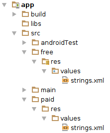

#[Gradle：全新安卓构建系统](http://tools.android.com/tech-docs/new-build-system/user-guide)

##优势
+  支持多渠道、多APK打包；

##Multi-flavor
+  src目录下有main文件夹，这是app的base部分；
+  支持多种flavor/variant，例如debug，release，paid，free等，分别在src目录下创建相应的文件夹，编写相应的代码；main文件夹下的代码是共用的，而相应文件下下的代码只在相应flavor/variant中使用；
+  每个文件夹下都可以编写自己的java代码，使用自己的res资源文件等；
+  在Android studio的build variants面板中可以选择构建的flavor；
  
文件结构如下图：  



##Basic Project
+  工程结构：创建新工程时，自动会生成main和androidTest目录，分别存放工程文件和测试代码；androidTest目录下不需要manifest文件，将自动生成；
+  可以通过配置，修改/重新指定各种文件的位置：
    ```groovy
    android {
        sourceSets {
            main {
                manifest.srcFile 'AndroidManifest.xml'
                java.srcDirs = ['src']
                resources.srcDirs = ['src']
                aidl.srcDirs = ['src']
                renderscript.srcDirs = ['src']
                res.srcDirs = ['res']
                assets.srcDirs = ['assets']
            }
    
            androidTest.setRoot('tests')
        }
    }
    ```
+  tasks：apply plugin时，会自动添加plugin定义的task（java和android包括：assemble，check，build，clean。build包括assemble和check）；
+  和make类似，上次执行之后没有改变的task下次将不会执行；
+  build的配置可以动态化：  
    ```groovy
    def computeVersionName() {
        ...
    }
    
    android {
        compileSdkVersion 19
        buildToolsVersion "19.0.0"
    
        defaultConfig {
            versionCode 12
            versionName computeVersionName()
            minSdkVersion 16
            targetSdkVersion 16
        }
    }
    ```
    注意：方法名不能和默认的getter重名；
+  buildTypes && productFlavors    配置不同的打包类型，两者为组合关系；
  +  Build Type + Product Flavor = Build Variant
  +  不同buildTypes的sourceSets可以重新指定；会创建对应的assemble&lt;BuildTypeName&gt; task；
  +  main和不同类型的manifest文件将会合并；资源文件也将合并，同名的将以具体build type覆盖main中的资源；
  
##依赖、安卓库、多工程配置
+  声明依赖
  +  本地jar文件：  
    ```groovy
    dependencies {
        compile files('libs/foo.jar')
    }
    ```
  +  远程依赖：  
    ```groovy
    repositories {
        mavenCentral()
    }
    
    
    dependencies {
        compile 'com.google.guava:guava:11.0.2'
    }
    ```
  +  library project依赖：
    ```groovy
    dependencies {
        compile project(':libraries:lib1')
    }
    ```
+  依赖类型
  +  compile：用于主应用程序的依赖编译，所有的内容都会加入到classpath中，并且打包到APK文件中；
  +  androidTestCompile：用于集成测试程序（或称InstrumentatinTest）；
  +  testCompile：用于单元测试；
  +  provided：？？TODO？？
  +  debugCompile：debug Build Type；
  +  releaseCompile：release Build Type；
  +  APK文件总是使用两种依赖类型：compile和&lt;buildtype&gt;Compile；
  +  创建新的build type，就可以使用对应的&lt;buildtype&gt;Compile声明依赖；
+  library project最终将打包为.aar文件，包含编译后的代码、资源文件；library在被其他工程引用时，其依赖只有compile类型的才会被继承；