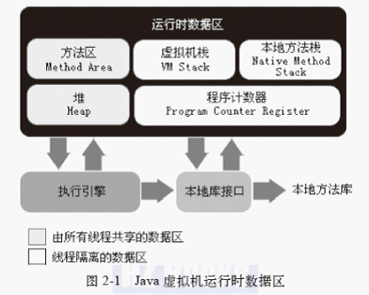

#深入理解Java虚拟机

#第二部分 自动内存管理机制

##第二章 Java内存区域与内存溢出异常
+  JVM内存区域  

  +  程序计数器：类似x86 EIP，每个线程都有一个程序计数器；执行native代码时计数器值为空；唯一不会抛出OOM的区域；
  +  Java虚拟机栈：线程私有；即函数调用栈，保存函数局部变量；
  +  Native方法栈：执行Native代码的函数调用栈；
  +  Java堆：新创建的对象存放区域；
  +  方法区：保存已加载的类信息、常量、静态变量、即时编译器编译后的代码等数据；有以永久代实现此区域的，也有以独立GC实现的；
  +  运行时常量池：是方法区的一部分；`String.intern()`方法有可能对此区域造成大的影响（依赖于JVM实现）；
  +  直接内存：NIO模块，为了提高内存访问效率，直接分配堆外内存，直接操作；
+  HotSpot虚拟机对象创建  
首先检查类的符号引用是否在常量池中，并检查该类是否已加载、解析、初始化；如果没有，则先进行加载；  
然后为对象分配内存空间，对象所占空间在类加载完成后即可确定；  
堆内存管理大致有两种方式：指针碰撞；空闲列表。依赖于GC时是否会对回收的内存进行压缩整理；  
分配内存的同步性保证：分配过程原子化；将内存分配按照线程划分在不同的空间中（本地线程分配缓冲，TLAB）。后者可通过JVM参数控制；  
内存分配完后，将内存空间初始化为零值，不包括“对象头”，初始化工作可以提前至TLAB分配时进行；  
设置“对象头”，例如：对象是哪个类的实例，类的元数据信息地址，对象hash值，GC分代年龄等信息；根据虚拟机当前的运行状态不同，是否启用偏向锁等，对象头会有不同设置方式；  
执行类的&lt;init&gt;方法；
+  HotSpot虚拟机对象的内存布局  
分为三部分：Header，实例数据，对其填充；  
实例数据部分，相同宽度的字段会分配到一起；满足该前提下，父类的变量出现在子类前；CompactFields参数为true时，子类中较窄的变量可能会插入到父类变量的空隙之中；  
对象大小8字节对其；
+  对象的访问定位  
在堆上建立了对象，使用的时候基本都是通过栈上的reference来操作堆上的对象；  
目前主流有两种访问方式：使用句柄；直接指针；
  +  使用句柄  
  在堆上划分一块内存作为句柄池，reference指向的是对象的句柄地址，句柄中包含了对象实例数据与类型数据各自的具体地址信息；句柄地址是稳定的，对象移动时只需修改句柄的内容，不必修改reference；
  +  直接指针  
  reference直接指向堆上对象地址；访问速度快，只需一次指针定位；HotSpot使用直接指针方式；
+  各种可能的OutOfMemoryError异常
  +  堆溢出  
  ```java
  java.lang.OutOfMemoryError: Java heap space...
  ```
  log中明确指出heap space，可通过JVM参数设置堆大小、最大大小、发生OOM后dump堆上数据；  
  一般通过分析dump数据，确认内存中的对象是否必要，即确定是内存泄漏还是内存溢出；  
  如果是内存泄漏，可进一步查看泄漏对象到GC Roots的引用链，根据引用链，基本就能定位泄漏代码的位置了；  
  如果是内存溢出，则可通过增加JVM堆内存、审查代码，减少对象生命周期，减少程序运行期间的内存消耗；
  +  虚拟机栈与本地方法栈溢出  
  StackOverFlowError，OutOfMemoryError  
  当每个线程分配的栈容量越大时，发生StackOverFlowError时创建的线程数越少，因为每个进程的内存是有限的，栈容量越大，则允许的线程数越少；通过减少线程数、更换64位虚拟机（增加内存）、减少最大堆和栈容量，均可缓解这一错误；
  +  方法区与运行时常量池溢出  
  ```java
  java.lang.OutOfMemoryError: PermGen space...
  ```
  永久代区域内存大小可以配置，如果方法区以永久代实现，则`String.intern()`方法就可能导致该错误；  
  类的卸载条件非常苛刻，如果运行时使用了大量的动态生成类，有可能导致该错误；
  +  直接内存溢出  
  ```java
  java.lang.OutOfMemoryError: ...
  ```
  在dump文件中看不出明显异常；  
  直接内存区域可以通过JVM参数配置，默认与堆最大值一样；
  
##第三章 垃圾收集器与内存分配策略
+  是否可被回收
  +  引用计数法  
  为每个对象添加一个引用计数器，当计数器为0时，可被回收；Python等语言使用，Java不是；无法解决循环引用的问题；
  +  可达性分析  
  从GCRoots出发，对所有的对象引用关系图进行一次遍历，不可达的对象可被回收；Java使用；GCRoots包括：虚拟机栈中引用的对象；方法区中静态类属性引用的对象；方法区中常量引用的对象；本地方法栈中JNI引用的对象；
  +  四种引用类型
    +  强引用  
    普通赋值即为强引用；只要有强引用，就不会被GC；
    +  软引用(SoftReference)  
    用来引用那些有用，但非必须的对象；在系统将要发生内存溢出错误之前，会将软引用指向的对象列入回收范围并进行二次回收，如果仍内存不足，将抛出OOM；
    +  弱引用(WeakReference)  
    作用与软引用类似，但强度更弱；GC过程中，无论内存是否足够，只被弱引用指向的对象，都将被回收；
    +  虚引用(PhantonReference)  
    对对象的生存周期完全没有影响，也无法通过虚引用来获取对象实例，仅仅能在对象被回收时，得到一个系统通知（只能通过是否被加入到ReferenceQueue来判断是否被GC，这也是唯一判断对象是否被GC的途径）；
  +  finalize()方法  
  当可达性分析结果为不可达时，GC器首先会判断是否需要执行finalize()方法，只有当类重写了finalize方法，且该对象的finalize方法未被调用，才需要执行；  
  finalize方法被放在一个虚拟机自动建立、低优先级的线程调用，且不保证执行完毕；  
  不需要执行finalize时，将被GC；  
  在finalize方法中，对象可以通过把自己挂到GCRoots引用链上进行GC逃逸，但只有一次机会；  
  而如果使用虚引用，则可以避免GC逃逸的问题出现，这也是虚引用的第二个使用场景；  
  千万不要把finalize()方法和C++的析构函数等同；
  +  回收方法区  
  包括常量、类，这两部分；  
  常量与普通对象类似，判断引用状态即可；  
  类的判断比较苛刻：该类的所有对象均已被回收；加载该类的ClassLoader已被回收；该类对应的`java.lang.Class`对象未在任何地方被引用。而且这只是充分条件；  
  在使用反射、动态代理、CGLib等ByteCode框架、动态生成JSP以及OSGI等频繁自定义ClassLoader的场景都需要虚拟机具备类卸载的功能，以避免方法区溢出；
+  垃圾收集算法
  +  标记-清除算法  
  第一阶段，判定对象可回收之后，将其标记，第二阶段，统一回收被标记的对象；  
  两个阶段效率都不高；另外存在碎片化问题；
  +  复制算法  
  将可用内存均分为两块，每次只使用其中一块，当一块用完之后触发GC，将存活的对象复制到另一块，再一次性清理已使用的一块；  
  效率高，不存在内存碎片；但是内存缩小一半，空间开销大；  
  现代商用JVM均使用复制算法来回收新生代，HotSpot虚拟机默认将内存分为8:1:1三块，一块Eden空间，两块较小的Survivor空间，每次使用Eden和一块Survivor，用完后将存活对象复制到另一块Survivor空间，集中回收已用部分；当一块Survivor不够复制时，将通过分配机制进入老年代；
  +  标记-整理算法  
  标记过程同“标记清除算法”，标记结束后，通过将所有存活对象都向一端移动，然后直接清理边界外的内存；
  +  分代收集算法  
  现代商用JVM均采用分代收集算法；一般把堆分为新生代和老年代；  
  新生代一般98%的对象都会很快被回收，使用复制算法；  
  老年代使用标记-清理，或者标记-整理算法；
+  HotSpot的算法实现  
...

##第七章 虚拟机类加载机制
+  类的生命周期
  +  加载、验证、准备、解析、初始化、使用、卸载
  +  验证、准备、解析，通常称为链接过程
  +  加载、验证、准备、初始化、卸载，这五个阶段的开始顺序是确定的，解析阶段可能在初始化之后再开始，用于支持动态绑定；仅仅是开始顺序，并不是进行/完成的顺序；
  +  类加载的时机并未明确规定，但是初始化明确规定，当且仅当以下5中情况，若类未初始化，必须立即对类进行初始化：
    +  遇到new、getstatic、putstatic或invokestatic这4条字节码指令时（new一个类，访问static成员/方法，`static final`成员除外，它们在编译期放入了常量池）；
    +  使用`java.lang.reflect`包得方法对类进行反射调用的时候；
    +  初始化一个类，然而其父类未初始化时，先初始化父类；
    +  虚拟机启动时用户指定的要执行的主类；
    +  当使用JDK 1.7的动态语言支持时，如果一个`java.lang.invoke.MethodHandle`实例最后的解析结果REF_getStatic、REF_putStatic、REF_invokeStatic的方法句柄，并且方法句柄对应的类未初始化；
  +  这5种行为称为主动引用，可能会触发类的初始化；其他的行为均不会触发类的初始化，称为被动引用，例如：
    +  通过子类引用父类的静态成员，不会导致子类初始化
    +  通过数组定义（new一个数组），并不会触发数组元素类的初始化，但是虚拟机会自动生成一个直接继承于Object的子类，该类封装了对数组的访问
    +  `static final`成员会被放入常量池，访问它们不会触发类的初始化
  +  接口的初始化触发条件与类基本一致，仅有第三点不同：一个接口初始化时，不要求父接口完成初始化，只有在真正使用父接口时才会触发父接口的初始化
+  类加载的过程
  +  加载
    +  通过类的全限定名，获取定义此类的二进制字节流
    +  将字节流中的静态存储结构转化为方法区的运行时数据结构
    +  在内存中生成一个代表这个类的`java.lang.Class`对象，作为方法区这个类的各种数据的访问入口
    +  第一阶段最灵活，二进制流可以从任何位置、以任何方式获取，衍生了许多强大的技术（zip包、网络、动态代理），通过自定义类加载器即可利用这一灵活性
    +  数组的类型是虚拟机自动创建的，但也和数组元素的类加载器紧密相关
  +  验证
    +  编译器会对代码进行检查
    +  虚拟机会对字节码进行检查，包括：文件格式验证、元数据验证（修饰符、可见性、继承关系）、字节码验证（数据流、控制流分析，确定语义合法、符合逻辑，StackMapTable）、符号引用验证（可查找、可访问等）
  +  准备
    +  为static变量分配内存，设置零值（而非代码中定义的初始值，初始值在自动生成的<clinit>()函数中进行）；为static final变量直接设置初始值
  +  解析
    +  符号引用转换为直接引用，有些只有在运行时才能完成解析
  +  初始化
    +  <clinit>()函数，将static代码块、static（无final修饰）变量的赋值组合起来而成；static代码块访问static变量时，变量必须已经定义（代码位置相关性，可写不可读）
    +  父类的<clinit>()函数一定先于子类的执行，因此父类的static代码块先于子类的static变量赋值操作
    +  <clinit>()函数对于接口来说非必须，<clinit>()函数的线程安全性由虚拟机保证，static代码块中要避免耗时操作
  +  类加载器
    +  加载一个类到内存中
    +  比较两个类是否相等（equals()、isAssignableFrom()、inInstance()、instanceof操作），只有在两个类是由同一个类加载器加载的前提下才有意义
    +  双亲委派模型（Parents Delegation Model）  
    BootstrapClassLoader、sum.misc.Launcher$ExtClassLoader、sun.misc.Launcher$App-ClassLoader  
      
    除了BootstrapClassLoader，其他所有的类加载器都应有父类加载器，而且父子关系不是以继承方式实现，而是以组合方式：一个类加载器收到类加载请求后，首先调用父类加载器的加载方法，每一层次均如此，如果父类加载器无法完成加载，子加载器才尝试自己加载。  
    保证Java类体系的正确性。自定义ClassLoader一般把加载逻辑放在findClass中。
    ```java
    protected Class<?> loadClass(String className, boolean resolve) throws ClassNotFoundException {
        Class<?> clazz = findLoadedClass(className);

        if (clazz == null) {
            ClassNotFoundException suppressed = null;
            try {
                clazz = parent.loadClass(className, false);
            } catch (ClassNotFoundException e) {
                suppressed = e;
            }

            if (clazz == null) {
                try {
                    clazz = findClass(className);
                } catch (ClassNotFoundException e) {
                    e.addSuppressed(suppressed);
                    throw e;
                }
            }
        }

        return clazz;
    }    
    ```
    +  非双亲委派模型：JNDI、JDBC、JCE、JAXB、JBI；程序动态性，OSGI，代码热替换、模块热部署等；

##第八章 虚拟机字节码执行引擎
+  基于栈的执行引擎，而非基于寄存器
+  即时编译本地代码执行，JIT
+  局部变量表
  +  slot
  +  slot重用对垃圾回收可能会有影响，但是通过JIT可以解决
  +  局部变量不会被自动赋予零值，但编译器有些情况下会给提示
+  操作数栈
  +  不同栈帧之间可能有重叠，避免数据复制开销
  +  动态链接，每个栈帧中都包含一个指向运行时常量池中该栈帧所属方法的引用，用于支持动态链接
  +  方法返回地址
  +  附加信息：调试信息等
+  方法调用
  +  解析
    +  invokestatic：静态方法
    +  invokespecial：构造函数（<init>()）、私有方法、父类方法
    +  invokevirtual：调用虚方法
    +  invokeinterface：调用接口方法
    +  invokedynamic：动态解析
  +  分派
    +  静态分派（Method Overload Resolution）：方法重载，编译期分派，编译器选择最合适的重载版本；类似于C++的编译时多态：函数重载，模板；
    +  动态分派（Dynamic Dispatch）：方法重写，运行期分派；类似于C++的运行时多态：虚函数；
  +  动态类型语言支持  
  ...