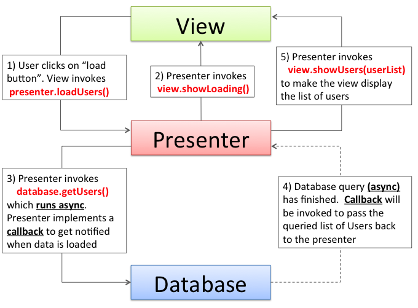

#MVP(Model-View-Presenter)模式

##工作流程

+  view通常会持有presenter的引用；
+  presenter持有view和model的引用；
+  model应该包括数据和对数据的获取或者修改操作；

##具体来说

+  MVP之间应该尽量解耦，可以通过定义接口来实现，相互持有的是接口引用；
+  view应该尽可能听从presenter的指令，而不是自己控制，如：接受presenter的showLoading指令之后才显示正在加载；
+  与用户的交互由view负责，显示的细节由view负责；

##MVP in Android(Mosby)
+  使用场景：单一的UI单元，例如fragment，或者一个ViewGroup，原则是这部分UI由一个presenter独立负责，不必相互干扰；
+  Acticity、Fragment更应该是view，而不是presenter；
+  core模块集成了Butterknife、FragmentArgs、Icepick等开源库；
+  MVP模块，定义了MvpPresenter，MvpActivity、MvpFragment类，作为presenter，view的基类；
+  MvpPresenter是一个接口，有一个MvpBasePresenter实现，使用WeakReference保存view的引用，所以presenter（子类）要调用view的接口时，需要调用isViewAttached()检查view是否有效，调用getView()获取其引用；
+  MvpLceView，模板化loading-content-error流程；
+  ViewState模块：保存view（并非android中的View）的状态，处理屏幕旋转、view（fragment、activity）重新创建时的状态恢复；
+  还有针对dagger、retrofit、rx、testing等的模块；

##一些建议
+  Don’t “over-architect”  
	In fact refactoring is a vital part of development, you simply can’t avoid it (but you can try to minimize the number of refactoring). Start with doing the simple thing and afterwards refactor and make it more extensible as app and requirements grow.
+  Use inheritance wisely  
	正确利用继承，基类拥有基本特点，子类增加新特性；避免“子类爆炸”；
+  Don’t see MVP as an MVC variant  

	Controller负责控制View(UI)和用户交互时应该执行的动作（调用Presenter的哪个方法）；当被Presenter调用显示方法时，如何显示（动效、数据使用方式）；
+  Take separation of Model, View and Presenter serious  
	写代码的时候，认真思考每一行代码的功能应该属于哪个模块，目前的位置是否合适？
  +  View负责UI显示，以及对UI、用户的响应
  +  Model负责数据获取、存储、处理
  +  Presenter负责配合/连接两者
+  Presentation Model
  +  当UI显示对于model的需求与数据源不一致时：最好的办法是加一层wrapper；其次是为model加一些方法，产生需要的域；最差的是为model加上这些域；
+  Navigation is a UI thing  
	不同界面之间的跳转应该由view负责