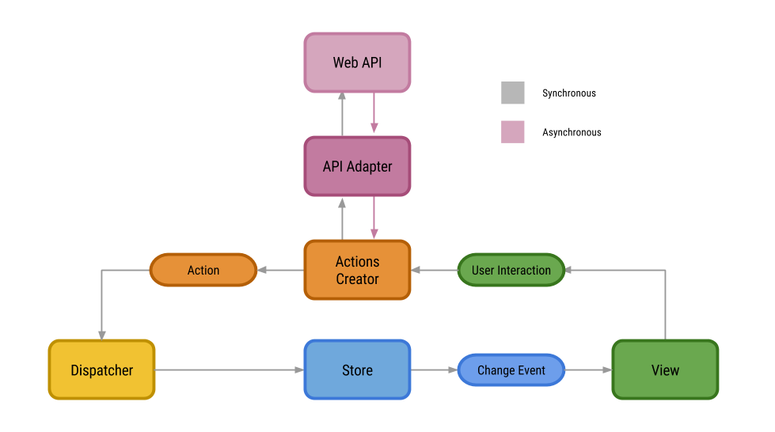

# Android项目架构
======
从功能需求、设计模式、最佳实践出发考虑

## MVP模式
数据、显示、控制解耦，[mosby](https://github.com/sockeqwe/mosby)，作者[blog1](http://hannesdorfmann.com/android/mosby/)，[blog2](http://hannesdorfmann.com/android/mosby-playbook/)

## 依赖注入
+  普通数据注入，[Dagger](http://google.github.io/dagger/)
+  View注入[ButterKnife](http://jakewharton.github.io/butterknife/)。

## 数据存储
+  ~~[squidb](https://github.com/yahoo/squidb)，基于注解，编译期生成DAO类，model类是编译期生成的，而不是定义表结构的类，对复杂SQL语句的支持非常好~~
+  [DBFlow](https://github.com/Raizlabs/DBFlow)，基于注解，编译期生成DAO类，对关系的支持很好
+  ~~[ActiveAndroid](https://github.com/pardom/ActiveAndroid)，基于注解，运行时转换~~
+  ~~[greenDAO](https://github.com/greenrobot/greenDAO)，编译期生成辅助代码~~
+  [StorIO](https://github.com/pushtorefresh/storio)，与rx集成，响应式DBHelper框架

## 网络连接处理
+  [Retrofit](http://square.github.io/retrofit/)，使用动态代理将java接口转化为REST API
+  [OkHttp](http://square.github.io/okhttp/)，优化的HTTP client（共享连接，连接池，透明压缩，缓存，重试等），支持web socket协议

## 异步处理
+  响应式编程（[rx](https://github.com/ReactiveX/RxAndroid)，在java7中使用lambda语法：[retrolambda](https://github.com/orfjackal/retrolambda)），消息的发出者和响应的接收者在同一模块内，局部性、单对单
+  事件处理（[EventBus](https://github.com/greenrobot/EventBus)，~~[Otto](http://square.github.io/otto/)~~），全局性事件、一对多比较合适

## 测试
+  单元测试（[我的印象笔记](https://www.evernote.com/shard/s425/sh/ed5e5a9b-8ebf-4d72-8d4d-62bff3b57335/a172972c726caab6)，[Robolectric](http://robolectric.org/)，使得Android代码能够在PC的JVM上运行测试，加快速度）
  +  对rx的单元测试，[非官方RxAssertions](https://gist.github.com/ivacf/874dcb476bfc97f4d555)，[官方TestSubscriber](http://reactivex.io/RxJava/javadoc/rx/observers/TestSubscriber.html)
  +  [AndroidTDD](AndroidTDD.md)
+  集成测试（[我的印象笔记](https://www.evernote.com/shard/s425/sh/52ec6ce5-68ca-47d7-8fa1-14fdacfc3f1a/31fceed7211d8e13)，[Espresso](https://code.google.com/p/android-test-kit/wiki/Espresso)）

## 持续集成
+  [jenkins-ci](http://jenkins-ci.org/)，整合代码托管工具，commit、merge request自动触发构建

## 工具
+  图片加载
  +  [Fresco](https://github.com/facebook/fresco)，多来源加载、缓存、内存管理（存放在安卓非堆特殊内存区域）、支持多种格式、多种功能（圆角）
  +  [Glide](https://github.com/bumptech/glide)，多来源加载、缓存、Object pool内存优化、Context生命周期加载优化、ListView、RecyclerView等加载优化
  +  ~~[Picasso](http://square.github.io/picasso/)，使用堆内存，格式稍少~~
+  模块热加载
  +  [dynamic-load-apk](https://github.com/singwhatiwanna/dynamic-load-apk)，通过代理实现启动、显示、执行安装时未定义的Activity，Service，实现模块热加载
+  错误统计
  +  [fabric](https://get.fabric.io/)，提供crash统计、以及twitter集成
+  调试
  +  [XLog](https://github.com/promeG/XLog)，函数调用追踪，log出参数、返回值、线程、执行时间，支持方法、类的注解；
  +  [Fresco](https://github.com/facebook/fresco)，chrome查看log，view heriachy，shared pref，db等；
  +  [LeakCanary](https://github.com/square/leakcanary)，memory leak检测工具；
+  时间
  +  [ThreeTenBP](https://github.com/ThreeTen/threetenbp)，JSR310的java 8以前的兼容实现，比安卓的Date类等强大无数倍；
  +  [ThreeTenABP](https://github.com/JakeWharton/ThreeTenABP)，安卓的一个包装，init过程性能更好；
+  导航
  +  [FragmentArgs](https://github.com/sockeqwe/fragmentargs)，Fragment启动时通过Argument传递参数
  +  [Dart](https://github.com/f2prateek/dart)，Activity之间通过Intent传递Extra参数
  +  [Pocket Knife](https://github.com/hansenji/pocketknife)，Activity的Extra传递参数，SavedInstance做状态保存/恢复
  +  [Aftermath](https://github.com/MichaelEvans/Aftermath)，A simple, annotation-based Android library for generating onActivityForResult handlers.
+  动效
  +  [rebound](https://github.com/facebook/rebound)，通过Android系统的property transition，加上各种变换函数，实现模拟物理的动效；
+  设计
  +  sketch
  +  [zeplin](https://zeplin.io/)
  
# Develop maintainable apps
+  Libraries  
选择第三方库时的考虑
  +  Documentation: 文档是否全面
  +  Repository Check-ins(Stability): 稳定性、是否保持维护
  +  Fulfils a Need: 满足项目需求
+  Domain design
  +  Keep code simple: OO，一个类只负责一件事
  +  Use MVC/MVP/MVVM Pattern
  +  Functional Test
  +  Use the tools: IDE的重构工具很强大
+  Code quality
  +  Readability matters
  +  工具
    +  CheckStyle
    +  Lint
    +  Findbugs
    +  PMD
  +  Refactor Gradually
+  Testing
  +  Unit test: Every single line of code that you write should be tested. Peroid. -- Robert Martin
  +  Junit(...) + Mockito
  +  Continuous Integration
  +  Code coverage
  
# [Android Clean Architecture](https://github.com/android10/Android-CleanArchitecture)
======
## 分层结构
  
+  Entities: These are the business objects of the application.
+  Use Cases: These use cases orchestrate the flow of data to and from the entities. Are also called Interactors.
+  Interface Adapters: This set of adapters convert data from the format most convenient for the use cases and entities. Presenters and Controllers belong here.
+  Frameworks and Drivers: This is where all the details go: UI, tools, frameworks, etc.
+  Dependency Rule: source code dependencies can only point inwards and nothing in an inner circle can know anything at all about something in an outer circle.  

## 安卓项目层次结构示例

## 使用Rx后的层次结构示例
  
+  Presentation layer: UI tests with Espresso 2 and Android Instrumentation.
+  Presenter && View test: 针对接口进行单元测试；对UI简单交互结果逻辑的测试（如：Activity跳转，Fragment切换，相关接口调用）；
+  Domain layer: JUnit + Mockito since it is a regular Java module.
+  Data layer: Migrated test battery to use Robolectric 3 + JUnit + Mockito.

## 代码组织（包组织）
+  Package by layer
+  Package by feature
  +  Higher Modularity
  +  Easier Code Navigation
  +  Minimizes Scope

# [Flux Architecture](http://lgvalle.github.io/2015/08/04/flux-architecture/)
======
+  结构图  

  +  View: Application interface. It create actions in response to user interactions. Activity or Fragment
  +  Dispatcher: Central hub through which pass all actions and whose responsibility is to make them arrive to every Store. An event bus.
  +  Store: Maintain the state for a particular application domain. They respond to actions according to current state, execute business logic and emit a change event when they are done. This event is used by the view to update its interface. Simple POJOs with two main attributes: Type: a String identifying the type of event; Data: a Map with the payload for this action.
  +  More about Stores
    +  Stores contain the status of the application and its business logic.
    +  Stores react to Actions emitted by the Dispatcher, execute business logic and emit a change event as result.
    +  ...

## [RxFlux](https://medium.com/@marxallski/rxflux-android-architecture-94f77c857aa2)
