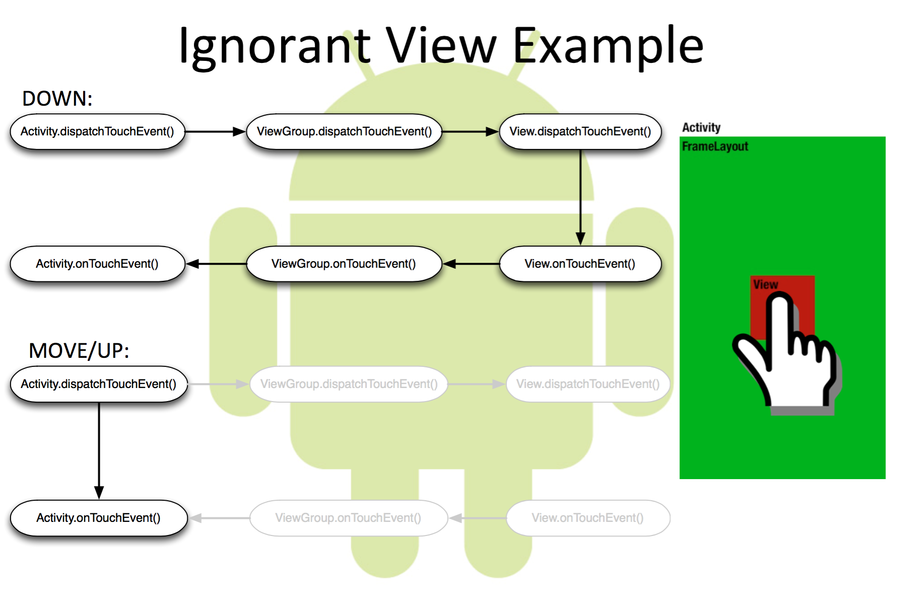
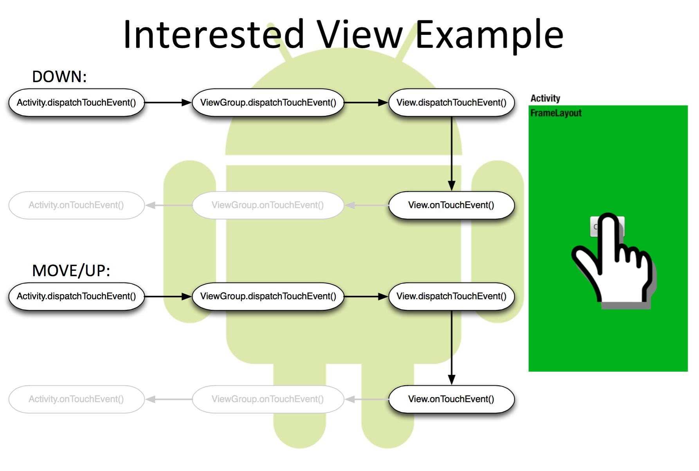

#安卓系统点击事件处理
[参考PPT](http://devsbuild.it/content/Mastering-Android-Touch-System)

##安卓系统点击事件处理框架
+  用户的点击事件均被包装为MotionEvent
+  MotionEvent描述了用户的行为
  +  ACTION_DOWN
  +  ACTION_UP
  +  ACTION_MOVE
  +  ACTION_POINTER_DOWN
  +  ACTION_POINTER_UP
  +  ACTION_CANCEL
+  MotionEvent还包括以下信息
  +  点击的位置（x, y坐标）
  +  触点的数量（手指）
  +  事件发生的时间戳
+  任何一个手势，都是以ACTION_DOWN起始，ACTION_UP结束
+  事件从Activity的dispatchTouchEvent()函数开始，沿着View层次树依次向下传递
  +  父元素把事件dispatch到子元素
  +  事件能在任意阶段被intercept
+  事件会沿着View层次树依次向下传递，然后又反向向上传递，知道被“消费”
  +  View如果对手势感兴趣，就必须消费掉ACTION_DOWN的事件
  +  出于性能的考虑，同一手势的后续事件将不会按照完整路径进行传递，而是直接传递到消费了ACTION_DOWN事件的View
  +  如果所有的View(ViewGroup)都没有消费掉事件，那它将传递到Activity的onTouchEvent()函数中，并结束传递过程，即如果没有被消费，也不会再继续传递了
+  可选的OnTouchListener能在任一View(ViewGroup)上intercept事件，事件被intercept之后，后面的调用将被传入ACTION_CANCEL  
+  `Activity.dispatchTouchEvent()`
  +  总是首先被调用
  +  Sends event to root view attached to Window
  +  如果所有的View(ViewGroup)都没有消费该事件，那么`Activity.onTouchEvent()`将被调用，而且这个函数是最后一个被调用的函数
+  `ViewGroup.dispatchTouchEvent()`
  +  首先调用`onInterceptTouchEvent()`函数，进行过滤处理
    +  检查是否应该替代孩子的处理
    +  Passes ACTION_CANCEL to active child
    +  如果要消费掉同一手势的所有后续事件，将返回true
  +  对所有的孩子，以添加顺序的逆序进行遍历
    +  如果点击在孩子的边界内，则调用`child.dispatchTouchEvent()`
    +  如果没有被当前的孩子消费，则传递到下一个孩子
  +  如果所有的孩子都未消费该事件，则传递给listener，`OnTouchListener.onTouch()`
  +  如果没有listener，或者listener也未消费，则自己处理，调用`ViewGroup.onTouchEvent()`
  +  Intercepted events jump over child step
+  `View.dispatchTouchEvent()`
  +  如果被设置了OnTouchListener，那么将先把事件发送到listener，调用`View.OnTouchListener.onTouch()`
  +  如果listener没有消费事件，将调用`View.onTouchEvent()`，即自己处理点击事件
+  例子
  +  View对事件不感兴趣  
  
  +  View对事件感兴趣  
  
  +  事件被ViewGroup intercept  
  
+  小结
  +  手势以ACTION_DOWN起始，以ACTION_UP结束
  +  ACTION_DOWN，在每一层View上都会调用`dispatchTouchEvent()`，该View会判断是否对接下来的手势感兴趣，后续的点击事件将直接传递到感兴趣的View
  +  ViewGroup可以intercept一个手势，因为`onInterceptTouchEvent()`是在`dispatchTouchEvent()`函数中最先被调用的，如果`onInterceptTouchEvent()`返回true，它的孩子将不会收到该手势的后续事件

##自定义点击事件处理
+  途径
  +  （View/ViewGroup子类，Target）重载`onTouchEvent()`函数
  +  为Target设置`OnTouchListener`
+  消费事件（`onTouchEvent()`）
  +  ACTION_DOWN：如果对手势感兴趣，那么ACTION_DOWN的event就要返回true，即便对于ACTION_DOWN不感兴趣
  +  后续的事件，同样返回true，结束事件的处理流程
+  ViewConfiguration的一些有用方法
  +  `getScaledTouchSlop()`：判断一个移动距离是否为drag
  +  `getScaledMinimumFlingVelocity()`：判断一个拖拽速度是否为fling
  +  `getLongPressTimeout()`：判断一个touch时间段是否为long press
+  传递点击事件  
调用target的`dispatchTouchEvent()`，不要直接调用target的`onTouchEvent()`
+  ViewGroup拦截点击事件
  +  重载`onInterceptTouchEvent()`
  +  如果对当前的手势感兴趣，`onInterceptTouchEvent()`返回true，之后的点击事件将不再经过`onInterceptTouchEvent()`函数
  +  其他的target（之前消费事件的View/ViewGroup）将收到ACTION_CANCEL
+  一些建议/警告
  +  尽量调用super的对应方法，父类中已经做了很多基础工作了
  +  ACTION_MOVE的处理中，检查移动距离是否超过slop（`getScaledTouchSlop()`）
  +  处理ACTION_CANCEL事件，父View可能会拦截事件，ACTION_CANCEL后需要重置状态，且之后该手势将不会再收到任何事件
  +  intercept之后，该手势之后的所有事件都将被拦截，所以不要轻易拦截
+  多触点事件响应
  +  `MotionEvent.getPointerCount()`：获取当前屏幕上的触点数量
  +  ACTION_POINTER_DOWN，ACTION_POINTER_UP用来响应次触点的事件，`MotionEvent.getActionMasked()`，`MotionEvent.getActionIndex()`
  +  MotionEvent的有些方法会有两个版本，带index参数的，用于获取第index个触点的数据；不带参数的，获取主触点（第一个触点）的数据
+  批量处理  
  +  出于效率的考虑，ACTION_MOVE可以被打包到一个MotionEvent进行处理
  +  最近一次（本次）事件的信息，通过标准的方法获取：`getX()`, `getY()`, `getEventTime()`
  +  本次和最早一次ACTION_MOVE的信息，通过相应historical的方法获取
    +  `getHistorySize()`获取打包的数量
    +  `getHistorical*(pos)`获取第一个触点的第pos个历史事件的信息
    +  `getHistorical*(index, pos)`获取第index个触点的第pos个历史事件的信息
  +  Can reconstruct all events as they occurred in time for maximum precision
+  System Touch Handlers
  +  不要首先就考虑使用自定义的事件处理方式
  +  `OnClickListener`
  +  `OnLongClickListener`
  +  `OnTouchListener`
    +  监听每一个MotionEvent，而不需要编写子类
    +  可以在Listener中消费事件
    +  View的onTouchEvent处理中，优先调用的是listener的处理函数
  +  `OnScrollListener` / `View.onScrollChanged()`
  +  `GestureDetector`
    +  onDown(), onSingleTapUp(), onDoubleTap()
    +  onLongPress()
    +  onScroll() (userdraggingfinger)
    +  onFling() (userreleaseddragwithvelocity)
  +  `ScaleGestureDetector`
    +  onScaleBegin(),onScale(),onScaleEnd()
  +  Handled via OnTouchListener or onTouchEvent()
  +  Disadvantages
    +  Consume UP events and exposes no interface for CANCEL events
    +  May require added touch handling if these cases need special handling (e.g. reset a View's appearance)
+  Touch Delegate
  +  Specialized object to assist in forwarding touches from a parent view to its child
  +  Allows for the touch area of a specific view to be different than its actual bounds
  +  Called in onTouchEvent() of attached View（Events have to make it that far without being consumed by a child or listener）
  +  TouchDelegate is designed to be set on the PARENT and passed the CHILD view that touches should be forwarded to  
  ```java
  ViewGroup parent;
  View child;
  Rect touchArea;
  parent.setTouchDelegate(new TouchDelegate(touchArea, child));
  ```