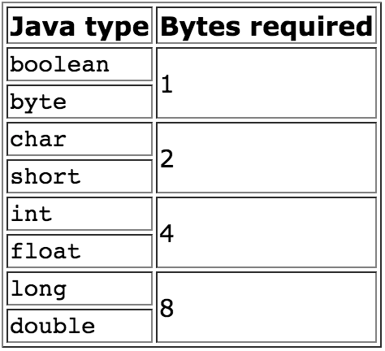

#Java对象内存的使用情况

##一般情况
+  primitive types  

+  Object overhead for "housekeeping" information  
recording an object's class, ID and status flags such as whether the object is currently reachable, currently synchronization-locked etc.  
Hotspot JVM：
  +  Object类实例：8字节；
  +  Object类实例数组：12字节，比Object类实例多了个length域；
+  Object size granularity  
为了便于寻址，对象内存会8字节对齐；  
例子：
  +  Object类实例8字节；
  +  只有一个boolean成员的类对象，16字节，有8个boolean成员的类对象，16字节；
  +  有两个long成员、三个int成员、一个boolean成员的类对象，40字节；
  
##数组
+  object header：12个字节，多了一个length域
+  一维数组，数据区域，length * sizeof(element)，此外，对于object是保存的引用，为4字节
+  二维数组，每一行都是一个数组，故每一行都有object的开销
+  例子：10*10 int二维数组：
  +  外层header：12字节
  +  外层数据（10个引用）：10*4=40字节，加上padding，共56字节
  +  内层每一行，header12字节
  +  内层每一行，数据10*4=40字节，加上padding，每一行共56字节
  +  总共56*11=616字节
+  更多维的数组逻辑一致

##String
+  一个String对象实际上包含了不止一个对象
+  java的char占两个字节
+  Minimum String memory usage (bytes) = 8 * (int) ((((num chars) * 2) + 45) / 8)
+  String对象包含：char数组，offset，length，hashcode这四部分内容
+  空String对象占用内存：8(header) + 3*4(上述三个int域) + 4(char数组引用) + 12(空char数组header) + 4(char数组padding) = 40字节
+  包含17个字符的String：24 + (12 + 17*2 + 2) = 72字节
+  substring使用时的trick
  +  如果原string和substring都会被使用，则节省了内存
  +  如果原string不再被使用，有可能就会浪费内存
  +  例如：  
  原有的char数组并不会被回收，但是只使用了其中的一部分：
  ```java
  String str = "Some longish string...";
  str = str.substring(5, 4);
  ```
  原有的char数据将来会被gc，避免了内存浪费：
  ```java
  String str = "Some longish string...";
  str = new String(str.substring(5, 4));
  ```
  
##string buffers
StringBuffer、StringBuilder等  
header: 8字节；length，char数组引用；底层char数组所占内存；  
假设初始容量为16的string buffer：16 + 12 + 16*2 + 4 = 64字节  
扩容策略是每次倍增容量

##减少String占用的内存
+  通常不需要，只有确定String占用了太多内存后才有必要。
+  一下情形并不需要String，有更节省内存的CharSequence实现。
  +  storing the string in memory;
  +  printing out the string or writing it to a stream;
  +  retrieving individual characters/substrings from the string;
  +  performing matches against regular expressions.
+  不使用String的优化方案：
  +  使用string buffer，通过`trimToSize()`可以至少比String少8字节
  +  只用来保存ASCII字符，使用byte[]更高效，或自行实现CharSequence接口，使用更节省内存的底层结构，只在最后需要使用的时候转化为String
+  必须使用String时的优化方案
  +  创建substring时，如果原string不再使用，那应该通过new一个新的String，而不是直接赋值给原引用
  +  当有很多内容相同的String对象时，可以通过两种方式节省内存：
    +  将内容定义为enum，使用时使用enum值
    +  规范化：使用`String.intern()`方法；使用HashMap等集合；  
    ```java
    String employeeStatus = rs.getString(2);
    employeeStatus = employeeStatus.intern();
    ```
    +  intern()：将String的内容放到JVM的string pool中，此过程不可逆，很可能会导致内存泄漏；因此只有确定内容只有很少的几种时才可行；