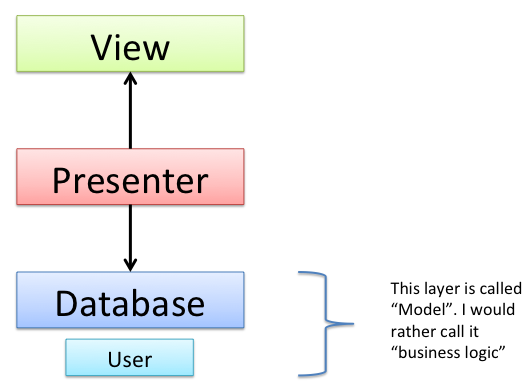
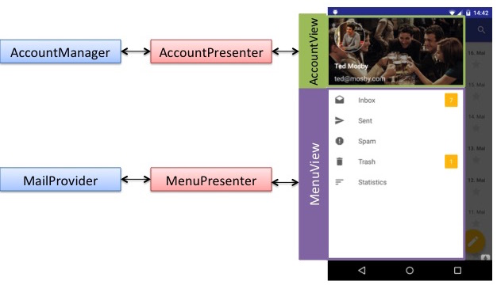

#MVP(Model-View-Presenter)模式

##[工作流程](http://hannesdorfmann.com/android/mosby/)

+  view通常会持有presenter的引用；
+  presenter持有view和model的引用；
+  model应该包括数据和对数据的获取或者修改操作；

##具体来说

+  MVP之间应该尽量解耦，可以通过定义接口来实现，相互持有的是接口引用；
+  view应该尽可能听从presenter的指令，而不是自己控制，如：接受presenter的showLoading指令之后才显示正在加载；
+  与用户的交互由view负责，显示的细节由view负责；

##MVP in Android(Mosby)
+  使用场景：单一的UI单元，例如fragment，或者一个ViewGroup，原则是这部分UI由一个presenter独立负责，不必相互干扰；
+  Acticity、Fragment更应该是view，而不是presenter；
+  core模块集成了Butterknife、FragmentArgs、Icepick等开源库；
+  MVP模块，定义了MvpPresenter，MvpActivity、MvpFragment类，作为presenter，view的基类；
+  MvpPresenter是一个接口，有一个MvpBasePresenter实现，使用WeakReference保存view的引用，所以presenter（子类）要调用view的接口时，需要调用isViewAttached()检查view是否有效，调用getView()获取其引用；
+  MvpLceView，模板化loading-content-error流程；
+  ViewState模块：保存view（并非android中的View）的状态，处理屏幕旋转、view（fragment、activity）重新创建时的状态恢复；
+  还有针对dagger、retrofit、rx、testing等的模块；

##[一些建议](http://hannesdorfmann.com/android/mosby-playbook/)
+  Don’t “over-architect”  
	In fact refactoring is a vital part of development, you simply can’t avoid it (but you can try to minimize the number of refactoring). Start with doing the simple thing and afterwards refactor and make it more extensible as app and requirements grow.
+  Use inheritance wisely  
	正确利用继承，基类拥有基本特点，子类增加新特性；避免“子类爆炸”；
+  Don’t see MVP as an MVC variant  
  
	Controller负责控制View(UI)和用户交互时应该执行的动作（调用Presenter的哪个方法）；当被Presenter调用显示方法时，如何显示（动效、数据使用方式）；
+  Take separation of Model, View and Presenter serious  
	写代码的时候，认真思考每一行代码的功能应该属于哪个模块，目前的位置是否合适？
  +  View负责UI显示，以及对UI、用户的响应
  +  Model负责数据获取、存储、处理
  +  Presenter负责配合/连接两者
+  Presentation Model
  +  当UI显示对于model的需求与数据源不一致时：最好的办法是加一层wrapper；其次是为model加一些方法，产生需要的域；最差的是为model加上这些域；
+  Navigation is a UI thing  
	不同界面之间的跳转应该由view负责
+  onActivityResult() and MVP  
	当result仅仅用于显示时，无需涉及presenter；当需要额外处理时，例如图片处理、上传等，则需要放到presenter中去；
+  MVP and EventBus - A match made in heaven  
	EventBus常被用于业务逻辑事件、UI更新事件（fragment之间通信）
  +  前者presenter负责接收event，控制view显示；
  +  后者有一种常见做法：Activity实现一个listener接口，让fragment持有该接口引用（attach时赋值），使用该接口进行通信；然而使用EventBus更合适，解耦更彻底；
+  Optimistic propagation  
	用户的操作，首先给其成功的反馈，然后在后台进行处理，失败后给出失败的提示，并撤销成功的反馈（显示），这种做法对于用户体验或许更佳；  
	如何看待内存泄漏：避免activity/fragment的泄漏，但对于presenter，如果希望操作执行完之后再被GC，则subscriber/runnable持有的presenter引用，可以认为是合理的；
+  MVP scales  
	MVP的V可以是整个屏幕显示的内容，也可以是屏幕上的某个模块显示的内容；
+  Not every View needs MVP  
	静态的页面并不需要MVP
+  Only display one Model per MVP view  
	一个V显示多个M会为代码增加复杂性，尤其是当需要保存ViewState时；合理的做法是将V拆分为独立的V，每个V只负责显示一个M；V可以是fragment，也可以是View/ViewGroup；例子：
	
+  Android Services  
	Service显然属于业务逻辑部分，由presenter与之通信是合理的；
+  Use LCE only if you have LCE Views  
	LCE还包含loadData，setData，如果没有这两个语义，就不要使用LceView，因为对接口的空实现，有违接口的规范；
+  Writing custom ViewStates  
	当需要保存view的状态时，定义好ViewState，并在view内维护、检查；
+  Testing custom ViewState  
	View和ViewState都是纯Java代码，可以使用Java的单元测试方法进行测试；
+  ViewState variants  
	有可能View既显示了数据，又在进行刷新操作，但是ViewState始终只会处于一个状态，通常的做法是为原来的状态再加一层修饰，加以区分；也可以定义一个新的ViewState；
+  Not every UI representation is a ViewState  	
	例如：显示空内容，并不是新状态，而是show content，只不过content为空；
+  Not every View needs a ViewState  
	mosby的ViewState通过SavedInstance保存，限制大小为1MB；另外保存的数据有可能是过时的，需要注意；
+  Avoid Fragments on the backstack and child fragments  
	fragment的生命周期中可能会有一些问题，所以尽量避免将fragment放入back stack，或者子fragment；
+  Mosby supports MVP for ViewGroups
+  Mosby provides Delegates  
	好处：
  +  可以把MVP模式应用到mosby未包含的类中，例如DialogFragment；甚至是第三方库；
  +  实现自定义的Delegate，可以改变默认Delegate的行为；