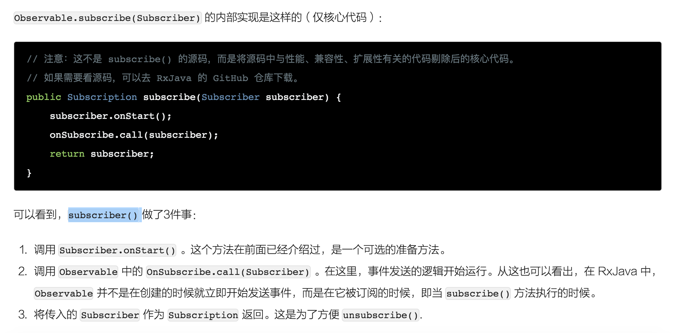
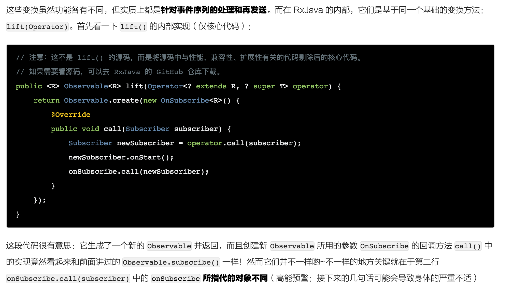
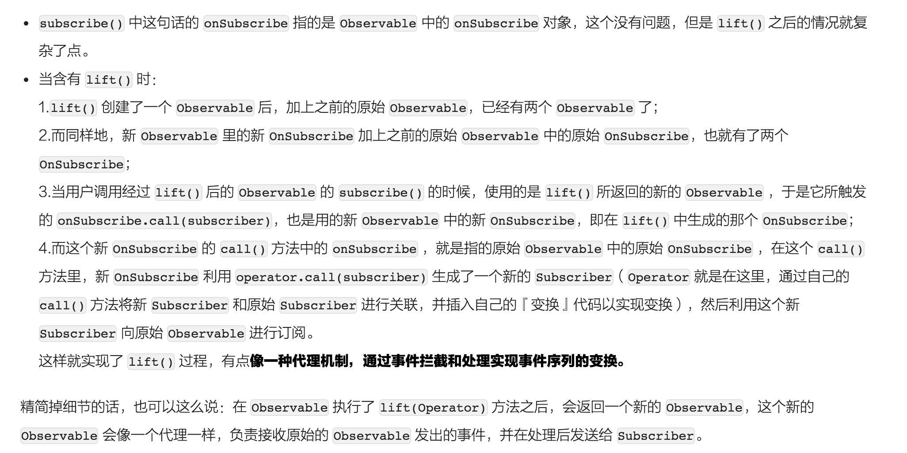

# Rx (Reactive eXtention)

四部分：事件流源头(source)，对事件流的操作(operator)，对最终事件流进行响应(subscriber)，以及整个过程的调度(schedule)。

## 原理
+  `subscribe`原理，引用自[给 Android 开发者的 RxJava 详解](http://gank.io/post/560e15be2dca930e00da1083#toc_10)

注意，选中的部分，应该是`subscribe()`而不是`subscriber()`。

+  `lift`变换原理，引用自[给 Android 开发者的 RxJava 详解](http://gank.io/post/560e15be2dca930e00da1083#toc_19)

+  `subscribeOn`和`observeOn`原理：也是用`lift`实现，通过相应`Operator`实现线程的切换

## 细节
+  just, from等操作均是在创建时执行，而非subscribe时，很显然，因为java函数调用传递的是值，所以会先eval；create, defer等操作均是在subscribe时执行；~~create多次subscribe只会执行一次，defer多次subscribe会执行多次~~（create、defer，call函数内的代码每次subscribe均会被执行）；[ref](https://github.com/Piasy/TestUnderstandRx/blob/242821254f/app%2Fsrc%2Ftest%2Fjava%2Fcom%2Fgithub%2Fpiasy%2Ftestunderstand%2Frx%2FHotColdObservableTest.java#L110)
+  hot v.s. cold Observable
  +  cold：当Observable被subscribe时才开始发射item；（后来的subscriber同样会收到其subscribe之前发射的item；retrofit实现的是cold；每次subscribe时，发射item的代码都会被执行）
  +  hot：创建之后就会开始发射item，不管是否被subscribe；（后来的subscriber不会收到其subscribe之前发射的item；）
+  map v.s. flatMap
+  将cold observable通过cache转换成hot之后，再在别处subscribe他们，有其应用场景：第一次subscribe时并不关心结果，但是后面某处想要获取结果，又不希望再次执行创建observable的过程；类似于预取思想；
+  怎么感觉有问题。。。
+  concat v.s. merge：concat不会让参数observable发射的item之间重叠，而merge可能会；concat传入的参数顺序是有影响的，merge没影响；
+  share v.s. replay
  +  replay
    +  需要调用connect方法后，observable才开始发射；
    +  后subscribe的subscriber会在subscribe的瞬间先收到其subscribe之前发射的所有item，然后再正常收到剩下的item；
    +  subscriber unsubscribe后将不会再接收到item，但也不会有onCompleted事件，且对其他subscriber不影响；
  +  实现的功能都需要测试验证，不能凭经验、也不能看博客，也不能仅看文档；

## Code review
+  [part I](http://artemzin.com/blog/rxjava-code-review-part-1)